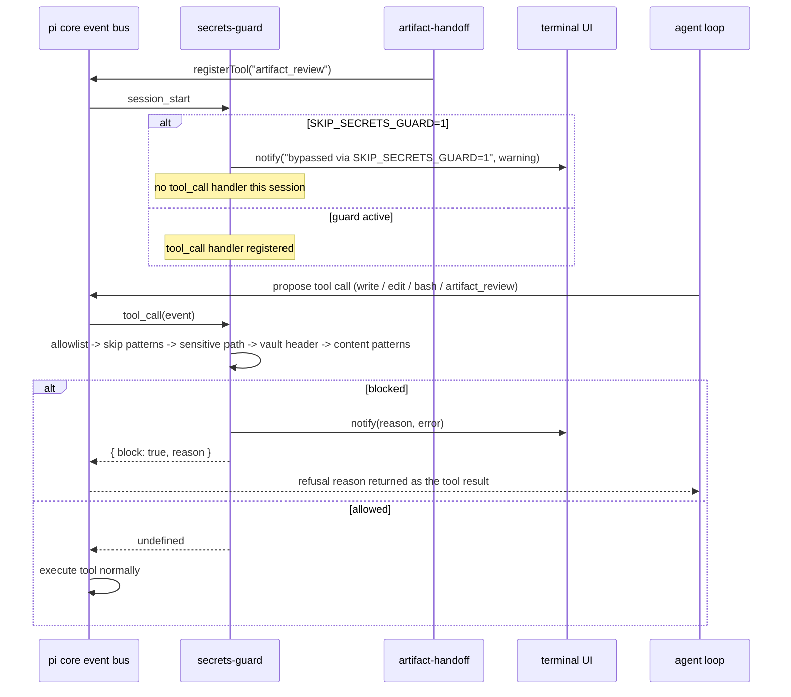
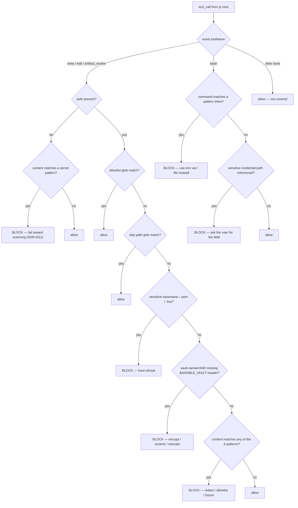
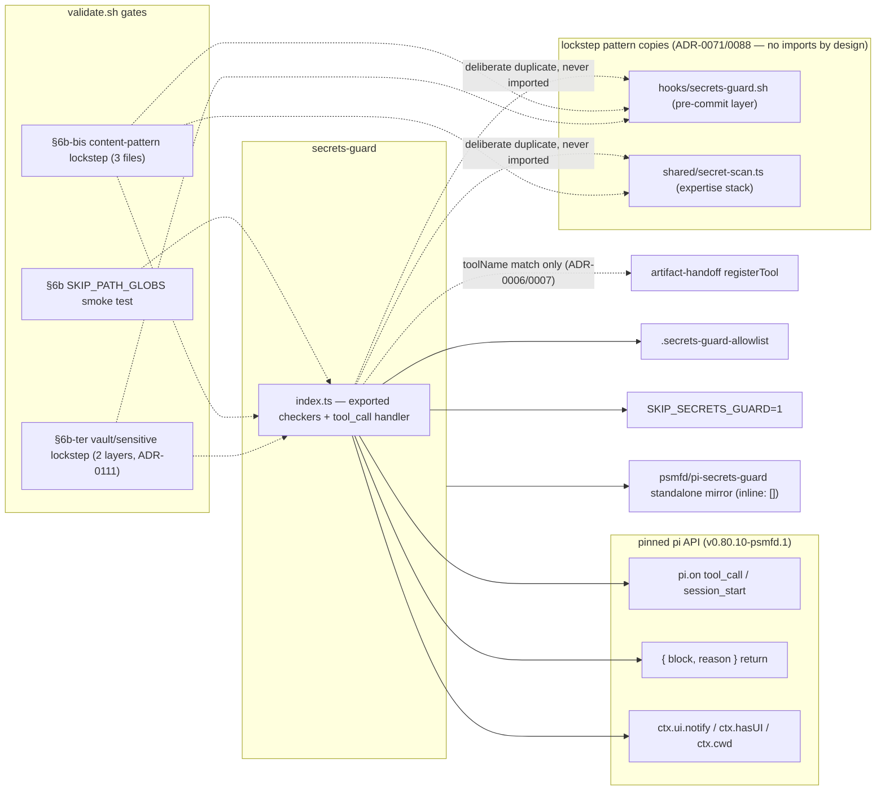

# secrets-guard

Pi extension that blocks tool calls which would write or surface secrets. Implements the runtime layer specified in [`agent/rules/secrets-guard.md`](https://github.com/psmfd/pi-config/blob/main/agent/rules/secrets-guard.md). The git pre-commit hook (`hooks/secrets-guard.sh`, also delivered in Phase C) covers the commit-time layer with the same patterns and override mechanisms.

## Install

```sh
pi install git:github.com/psmfd/pi-secrets-guard
```

Try it first without installing: `pi -e git:github.com/psmfd/pi-secrets-guard`.

## Hooked events

- **`tool_call` for `write`, `edit`, and `artifact_review`** — scans the content payload for secret patterns; refuses to write to vault-named files lacking the `$ANSIBLE_VAULT` header; refuses to write to sensitive basenames (`id_rsa`, etc.) or sensitive extensions (`*.pem`, `*.key`). `artifact_review` is the custom tool registered by [`artifact-handoff/`](https://github.com/psmfd/pi-artifact-handoff) (ADR-0006 § Tooling, ADR-0007); it is shaped like `write` (path + content) and joins the same branch — see [Tool-call coverage](#tool-call-coverage) below for the regression-test rationale.
- **`tool_call` for `bash`** — scans the command for inline secret literals and references to sensitive credential file paths (`~/.aws/credentials`, `~/.ssh/id_rsa`, `~/.kube/config`, `~/.netrc`, etc.). Public-key reads (`~/.ssh/*.pub`) are deliberately not blocked (ADR-0111).
- **`session_start` (bypass mode only)** — when `SKIP_SECRETS_GUARD=1`, emits a one-time warning notify naming the bypass; no `tool_call` handler is installed in this mode.



## Tool-call coverage

Custom tools that write content do **not** inherit `write`/`edit` coverage automatically — the tool-call handler matches on `event.toolName`. When a new write-shaped custom tool is registered, it MUST be added to the content-scan branch in `index.ts`. `artifact_review` is currently the only such tool.

`scripts/validate.sh` § 6b — secrets-guard SKIP_PATH_GLOBS smoke test asserts that `drafts/**` and `.review/**` are NOT in the `SKIP_PATH_GLOBS` constant. Either appearing there would silently disable scans for those paths and violate the ADR-0006 § Consequences commitment. The smoke test fails `validate.sh` if either glob is added.

## Patterns blocked

- PEM private-key headers (`-----BEGIN (RSA |EC |OPENSSH |DSA |PGP |ENCRYPTED |)PRIVATE KEY` — `ENCRYPTED` covers PKCS#8)
- AWS access key IDs (`AKIA|ASIA|ABIA|ACCA` + 16 alphanumerics, with word-boundary anchoring)
- GitHub tokens (`gh[oprsu]_[A-Za-z0-9]{36,}` — all five documented prefixes, open-ended body — and `github_pat_[A-Za-z0-9_]{82,}`)
- Signed JWTs (three dot-separated base64url segments, header/payload starting `eyJ`; ADR-095/#64)
- `Authorization: Bearer` literals (20+ token characters; placeholders like `%s`/`$VAR` never match)
- Unencrypted vault files — basename contains `vault` and ends `.yml`/`.yaml` ('vault' anywhere in the basename since ADR-0111, matching the pre-commit hook) lacking the `$ANSIBLE_VAULT` first-line header
- Writes to sensitive file paths (`id_rsa`, `id_dsa`, `id_ecdsa`, `id_ed25519`, the FIDO2 `id_ecdsa_sk`/`id_ed25519_sk`, plus `.pem`/`.key` variants)

The pattern set lives at the top of `index.ts` — a deliberate lockstep copy with `hooks/secrets-guard.sh` and `agent/extensions/shared/secret-scan.ts` (ADR-0071/0088), gated by `validate.sh` §6b-bis (content patterns, 3 files) and §6b-ter (vault-naming + sensitive basenames, 2 layers; ADR-0111).

## Skip patterns (extension does not scan)

Files matching `*.example`, `*.sample`, `*.template`, `*.j2`, or paths under `molecule/`, `tests/`, `spec/`, `fixtures/`.

## Decision ladder



## Refusal policy (per-rule)

The `damage-control-continue` pattern (from `disler/pi-vs-claude-code`, evaluated in #69) distinguishes **hard refusals** — where any retry is wrong and the agent should escalate to the user — from **continue-eligible** blocks, where the agent can recover by trying a modified approach. This extension classifies its rules accordingly; `reason:` payloads carry explicit guidance:

| Rule | Policy | Rationale |
|---|---|---|
| Write to sensitive basename (`id_rsa`, `*.pem`, `*.key`) | **Hard refusal** | Writing private-key material from an agent context is never the right action. `reason:` explicitly instructs the model not to retry and to escalate to the user. (Note: skip-pattern paths — `tests/`, `fixtures/`, `*.example`, `*.sample`, `*.template`, `*.j2` — are evaluated **before** the sensitive-basename check, so a fixture key under `tests/fixtures/fake_key.pem` is allowed. This is intentional.) |
| PEM / AWS-key / GitHub-PAT pattern in write or edit content | Continue-eligible | The agent can rename to a fixture path, regenerate without the literal, or add a known-false-positive to the allowlist. `reason:` enumerates these alternatives. |
| Vault-named file written without `$ANSIBLE_VAULT` header | Continue-eligible | The agent can encrypt first via `ansible-vault`, rename to a non-vault pattern, or relocate to a fixtures directory. |
| Inline secret literal in `bash` command | Continue-eligible | The agent can read from an env var or file instead of inlining the literal. |
| `bash` command references sensitive credential path | Continue-eligible | The agent can ask the user for just the needed field, use `test -f`/`ls -l` for existence checks, or escalate. |

Neither the upstream `damage-control.ts` nor `damage-control-continue.ts` were vendored. The pattern adoption is pi-native: pi's `{block, reason}` return is already the no-abort path (this extension has never called `ctx.abort()`), so the actionable change is the per-rule policy classification and adaptive-feedback wording in `reason:` payloads.

## Override mechanisms

Both surfaces **announce themselves via `ctx.ui.notify`** on use — silent overrides are not supported (ADR-0022 § Q5, backported per issue #258).

| Override | Scope | Visibility |
|---|---|---|
| `SKIP_SECRETS_GUARD=1` in pi's environment | Whole pi session | Visible in shell history; auditable; announced once at session start via `warning`-level notify |
| `.secrets-guard-allowlist` at repo root | Per-path glob, persistent | Version-controlled; visible in PR review |

The session-wide bypass loads the extension but installs no `tool_call` handler. The session-start announcement names the bypass env var for auditability; in non-UI sessions (e.g. `pi -p`) the notify call is suppressed cleanly via the `ctx.hasUI` guard.

The allowlist accepts one path glob per line (`*` matches a path segment, `**` matches across segments). Lines starting with `#` are comments. Use it for known-false-positives such as `tests/fixtures/fake_key.pem`. Never to suppress a real finding.

## When this extension is bypassed

- `SKIP_SECRETS_GUARD=1` in pi's environment — the extension loads but installs no hook.
- The path matches an allowlist entry — that single tool call is allowed; other calls in the same session are still scanned.
- The path matches a skip pattern — that single tool call is allowed.

## Dependencies and provenance



## Testing

`scripts/test-secrets-guard.sh` runs `test/*.test.ts`: `announce.test.ts`
(the SKIP_SECRETS_GUARD bypass announce + handler-registration contract) and
`detect.test.ts` (#796 — direct coverage of the exported
`checkWriteLikeCall`/`checkBashCall`: one blocked write per pattern class,
vault block/allow incl. the widened `*vault*.yml` form, sensitive-basename
refusals incl. FIDO2 keys, skip patterns, allowlist precedence, the
missing-path content scan, edit newText-only scanning, and the bash branch
incl. the `.pub` exception).

## Limitations

- Does not detect inline `!vault |` scalars in partially-encrypted YAML files (would require a YAML parser; out of scope).
- **Bash command scanning runs regex over the raw, unlexed command string** and is exposed to shell quote-splitting / substitution-obfuscation bypasses — the "GuardFall" class enumerated in [ADR-0072](https://github.com/psmfd/pi-config/blob/main/adrs/0072-guardfall-shell-injection-hardening.md); adopting the shared quote-aware lexer (`shared/shell-lex.ts`) is deferred to #505.
- Bash sensitive-path detection is conservative — only obvious read-and-leak filenames are flagged. Sophisticated exfiltration paths are not in scope for a regex-level guard.
- The extension scans the **first 512 KB** of any payload — write/edit content and bash commands alike (the same `findContentSecret` cap applies to both). Larger payloads are partially scanned.
